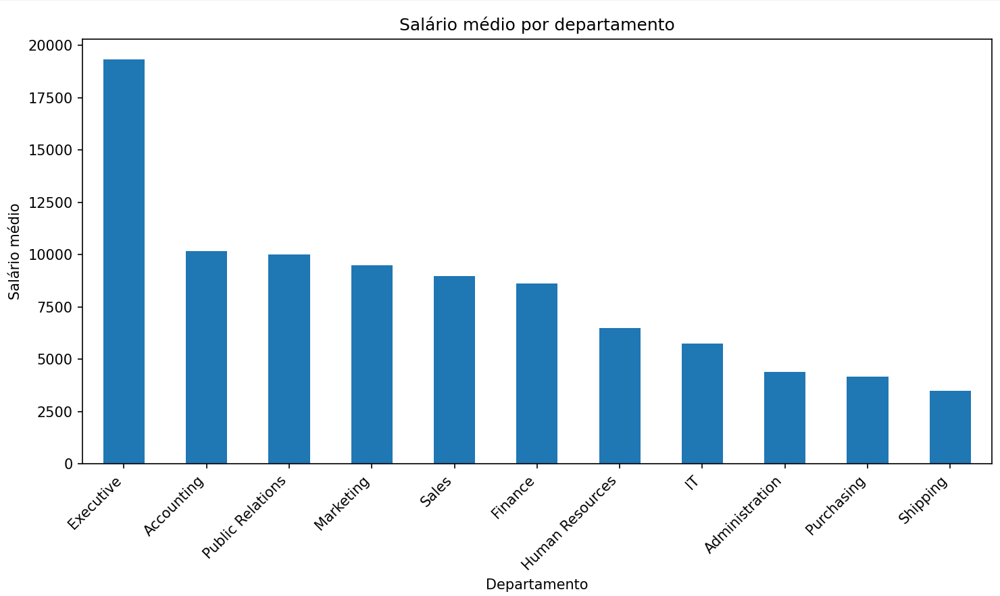
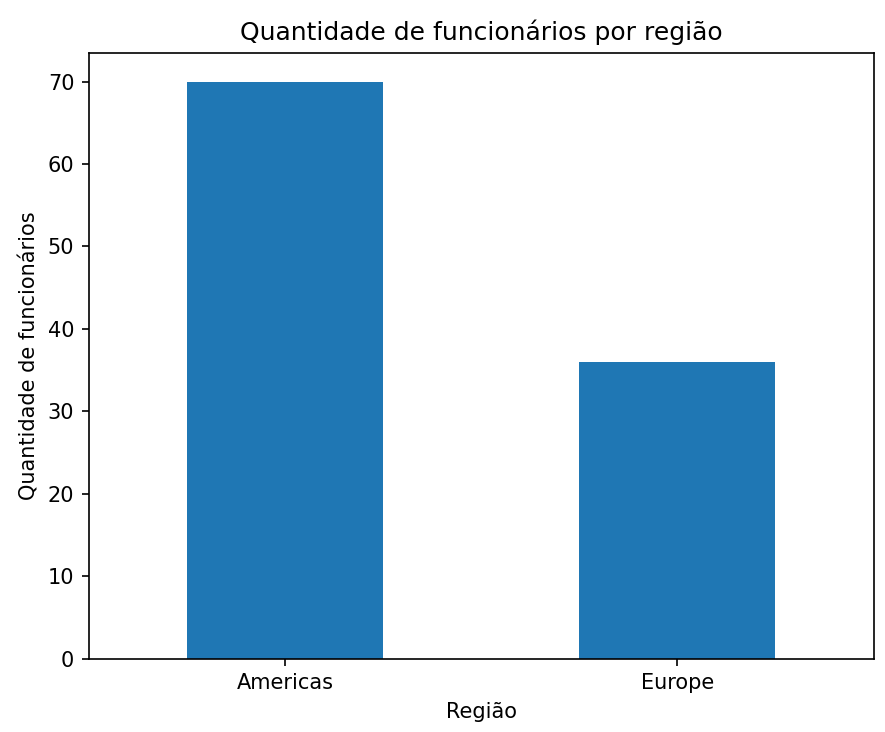
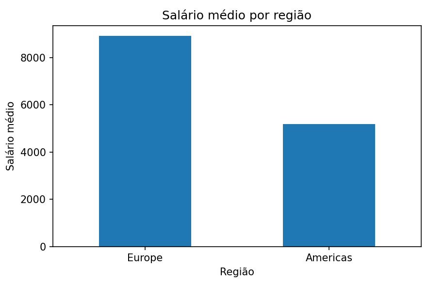
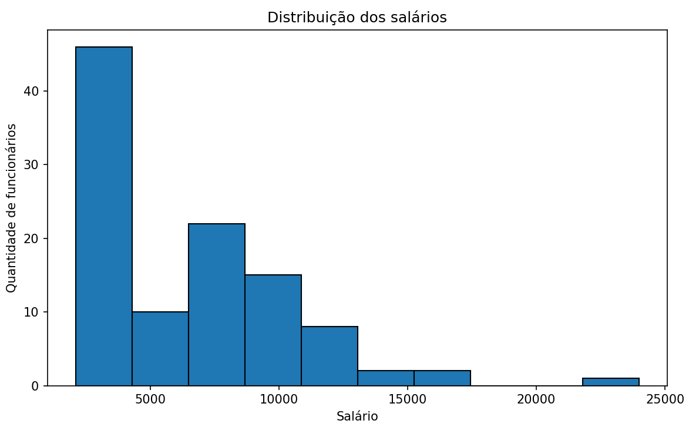

# 📊 Projeto Avaliativo – Análise de Dados de RH (Esquema HR)

## 👩‍🎓 Identificação

**Aluna:** Beatriz Rocha Bruns

**Turma:** QA INDS 2026/1 1

---

# 🎯 Objetivo do trabalho

Este projeto tem como objetivo realizar uma análise de dados utilizando o esquema HR do banco de dados Oracle FreeSQL. Para isso, foram desenvolvidas consultas SQL com múltiplos relacionamentos entre tabelas, permitindo extrair informações sobre salários, departamentos, cargos e localização dos funcionários.

Após a extração dos dados, os resultados foram exportados para arquivos CSV e analisados em Python, utilizando técnicas de Análise Exploratória de Dados (EDA), cálculo de medidas estatísticas e construção de gráficos para facilitar a interpretação dos resultados.

---

# 🗂️ Tabelas utilizadas

Durante o desenvolvimento do projeto foram utilizadas as seguintes tabelas do esquema HR:

- **EMPLOYEES:** contém os dados dos funcionários, como nome, cargo, salário e departamento.
- **DEPARTMENTS:** armazena as informações dos departamentos da empresa.
- **JOBS:** contém os cargos existentes e seus respectivos títulos.
- **LOCATIONS:** apresenta os dados de localização dos departamentos, como cidade e estado.
- **COUNTRIES:** contém os países associados às localizações.
- **REGIONS:** organiza os países por região geográfica.

Essas tabelas foram relacionadas por meio de comandos **LEFT JOIN**, permitindo reunir todas as informações necessárias para as análises propostas.

---

# 📝 Resumo das consultas SQL

## 🔹 Query 1 – Salário por Departamento e Cargo

A primeira consulta teve como objetivo analisar a distribuição dos salários por departamento e cargo.

Para isso foram utilizadas as tabelas:

- EMPLOYEES
- DEPARTMENTS
- JOBS

A consulta utilizou dois **LEFT JOIN** para relacionar as tabelas e aplicou o filtro:

```sql
WHERE e.department_id IS NOT NULL
```

O resultado foi exportado para o arquivo:

```
query_01.csv
```

---

## 🔹 Query 2 – Funcionários por Região

A segunda consulta teve como objetivo analisar a distribuição geográfica dos funcionários, considerando cidade, estado, país e região, além de permitir a comparação das médias salariais entre as regiões.

Foram utilizadas as tabelas:

- EMPLOYEES
- DEPARTMENTS
- LOCATIONS
- COUNTRIES
- REGIONS

A consulta utilizou quatro **LEFT JOIN** e o filtro:

```sql
WHERE e.department_id IS NOT NULL
```

O resultado foi exportado para:

```
query_02.csv
```

---

# 🐍 Análise realizada em Python

Após a exportação dos arquivos CSV, os dados foram importados para o Python utilizando a biblioteca **Pandas**.

Inicialmente foi realizada uma Análise Exploratória de Dados (EDA), utilizando os métodos:

- `head()`
- `info()`
- `describe()`
- `isnull()`

Posteriormente foram calculadas medidas estatísticas dos salários:

- média;
- mediana;
- valor mínimo;
- valor máximo.

Também foram realizadas análises utilizando agrupamentos (`groupby`) para identificar:

- média salarial por departamento;
- média salarial por cargo;
- quantidade de funcionários por região;
- média salarial por região.

Por fim, foram construídos gráficos utilizando a biblioteca **Matplotlib**, permitindo visualizar os resultados de forma mais clara.

---

# 🔍 Principais resultados encontrados

A análise permitiu identificar que:

- O departamento **Executive** apresentou a maior média salarial da empresa;
- Cargos de liderança, como **President** e **Administration Vice President**, possuem as maiores remunerações;
- A região **Americas** concentra a maior quantidade de funcionários;
- Embora possua menos funcionários, a região **Europe** apresentou a maior média salarial;
- A distribuição dos salários mostrou maior concentração de funcionários nas faixas salariais mais baixas, com poucos colaboradores recebendo salários elevados.

A partir desses resultados é possível perceber que existe uma diferença significativa entre departamentos, cargos e regiões, evidenciando diferentes níveis de remuneração dentro da empresa.

---

# 📊 Gráficos gerados

Durante a análise foram produzidos os seguintes gráficos:

- Salário médio por departamento;
- Quantidade de funcionários por região;
- Salário médio por região;
- Histograma da distribuição dos salários.

## Gráfico 1 – Salário médio por departamento



## Gráfico 2 – Funcionários por região



## Gráfico 3 – Salário médio por região



## Gráfico 4 – Histograma dos salários



---

# 🚀 Como executar o projeto

1. Clonar este repositório.

```bash
git clone https://github.com/brunsbea/projeto-avaliativo-analise-dados-rh.git
```

2. Instalar as bibliotecas necessárias.

```bash
pip install pandas matplotlib
```

3. Executar o arquivo Python.

```bash
python python/analise_rh.py
```

---

# 📁 Estrutura do projeto

```
projeto-avaliativo-analise-dados-rh/

├── data/
│   ├── query_01.csv
│   └── query_02.csv
│
├── python/
│   └── analise_rh.py
│
├── sql/
│   ├── query_01.sql
│   └── query_02.sql
│
├── .gitignore
└── README.md
```

---

# 💡 Sugestões de melhoria

Como evolução deste projeto, podem ser implementadas novas análises, como:

- comparação salarial entre países;
- análise da distribuição salarial por cidade;
- desenvolvimento de dashboards interativos utilizando Power BI ou Streamlit;
- inclusão de novos indicadores estatísticos;
- automatização da importação dos dados diretamente do banco de dados.

---

# 🛠️ Tecnologias utilizadas

- Oracle FreeSQL
- Oracle HR Schema
- SQL
- Python
- Pandas
- Matplotlib
- Git
- GitHub
- Visual Studio Code

---

# 🔗 Repositório

https://github.com/brunsbea/projeto-avaliativo-analise-dados-rh
